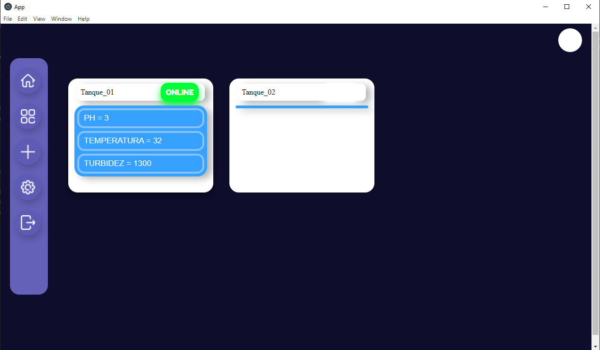
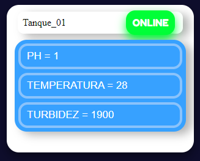
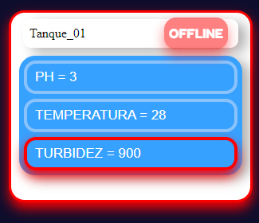
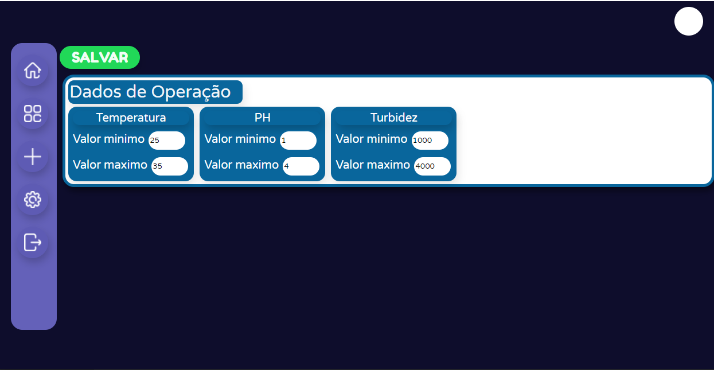

# 🐟 AquaMetrics IoT: Sistema de Monitoramento Telemetrico para Aquicultura

> **Projeto de Pesquisa e Inovação (IFCE) | Dez/2020 a Jul/2022**  
> **Atuação:** Desenvolvedor Full-Stack e IoT

## 📖 Sobre o Projeto e Meu Papel

Este projeto consistiu no desenvolvimento de uma plataforma Web/Desktop e IoT para o monitoramento automatizado de viveiros de tilápia. O sistema processa um alto volume de dados telemétricos em tempo real, garantindo a qualidade da água e a sobrevivência do cultivo.

**Meu impacto direto no projeto:**
Atuei como **Desenvolvedor Full-Stack e IoT**, sendo responsável por arquitetar e implementar a integração de hardware e software. Desenvolvi o motor de processamento utilizando **Python** e a interface do usuário com **Electron.js** e **Node.js**. Minha principal entrega foi a **resolução de problemas críticos de atraso (latência) na captação de dados de pH e temperatura**, implementando um sistema de processamento de alertas diários e entrega de notificações em tempo real.

---

## 🎯 Contexto e Motivação

O monitoramento preciso da qualidade da água é um fator crítico para a viabilidade e produtividade da aquicultura. No cultivo de tilápias, três parâmetros são vitais: **Temperatura, Turbidez e pH** (sendo este último o mais sensível para a sobrevivência da espécie).

O problema real enfrentado era a medição manual e o atraso na identificação de anomalias na água. O objetivo do projeto foi criar um sistema capaz de realizar a leitura contínua desses dados, disparando alertas imediatos para correções rápidas, reduzindo drasticamente a taxa de mortalidade dos peixes.

---

## 🏗️ Arquitetura do Sistema e Fluxo de Dados

O ecossistema foi desenhado em três camadas principais para garantir desacoplamento e processamento assíncrono em tempo real:

1. **Camada de Hardware (Edge / Sensores):** 
   - Sensores de Temperatura, pH e Turbidez acoplados a uma placa **Arduino**.
   - O microcontrolador (programado em **C++**) realiza a leitura analógica/digital dos parâmetros do tanque.
2. **Camada de Integração (Middleware):** 
   - Um serviço construído em **Python** atua como *engine* principal.
   - Comunica-se via porta Serial (CLI) com o Arduino, captando, filtrando e normalizando o alto volume de dados telemétricos, evitando gargalos.
3. **Camada de Aplicação e Interface (Client):** 
   - Aplicação Desktop desenvolvida com **Electron.js** e **Node.js** (utilizando HTML, CSS e JavaScript).
   - Consome os dados processados pelo Python, exibe *dashboards* em tempo real e executa a lógica de alertas operacionais.

---

## ⚙️ Funcionalidades Principais (Features)

- **Telemetria em Tempo Real:** Leitura ininterrupta dos sensores sem travamentos na interface.
- **Lógica de Decisão e Alertas:** Sistema de configuração de *thresholds* (limites mínimos e máximos) personalizável por tanque. O sistema alerta imediatamente se um parâmetro sai da faixa de segurança.
- **Gestão de Estados (Online/Offline):**
  - **Online:** Parâmetros estabilizados dentro da faixa configurada.
  - **Offline/Alerta:** Identificação visual imediata de qual tanque e qual sensor apresenta anomalia.

---

## 🧠 Decisões Técnicas e Trade-offs

Ao projetar o sistema, precisei equilibrar a construção de uma arquitetura robusta (visando baixo custo e alta manutenibilidade) com o meu estágio de carreira e curva de aprendizado na época. As principais escolhas envolveram os seguintes contextos e *trade-offs*:

* **Microcontrolador Arduino:** A escolha se deu principalmente pela viabilidade financeira e facilidade de aquisição. O objetivo prático era criar uma solução acessível para pequenos e médios produtores. O Arduino se mostrou perfeito para esse cenário, entregando a capacidade de gerenciar múltiplas leituras simultâneas dos sensores sem inflar o orçamento da pesquisa.

* **Python como *Engine* de Comunicação:** Em vez de tentar plugar a interface de usuário diretamente no hardware, optei por criar uma camada intermediária (*middleware*) em Python para ler o fluxo serial. Pessoalmente, foi uma decisão estratégica: era a linguagem com a qual eu tinha mais familiaridade e domínio na época, o que diminuiu drasticamente minha curva de aprendizado. Tecnicamente, essa escolha foi fundamental para resolver nossos problemas de atraso (latência) na captação dos dados, pois me permitiu focar em criar um motor de telemetria rápido e resiliente.

* **Electron.js vs. Interfaces Nativas (ex: PyQt):** Eu poderia ter construído as telas usando o próprio Python com bibliotecas de desktop como o PyQt. No entanto, o *trade-off* escolhido foi usar o **Electron.js**, mesmo sabendo que isso adicionaria uma camada extra de comunicação na arquitetura e um consumo ligeiramente maior de RAM. O motivo? Eu queria entregar uma experiência de usuário (UX) muito superior. O Electron me permitiu usar meu conhecimento em tecnologias Web (HTML, CSS, JavaScript) para desenvolver uma interface muito mais moderna, reativa e amigável para o usuário final, além de abrir portas para usar bibliotecas avançadas do ecossistema web para a análise visual dos dados.

---

## 💻 Interface e Telas (UI/UX)

> *As telas abaixo representam a interface da plataforma projetada para ser intuitiva para operadores de viveiros.*

### 1. Dashboard Inicial (Monitoramento de Tanques)
Apresenta a visão geral dos tanques monitorados. Cada "card" representa um viveiro e seus níveis atuais de pH, Temperatura e Turbidez.

> 

### 2. Status em Tempo Real: Online vs Alerta (Offline)
Sistema de cores e alertas visuais que mudam dinamicamente baseados na resposta da telemetria processada pelo Python.
- **Status Normal (Verde):** Todos os dados operam na normalidade.
- **Status Crítico (Vermelho):** Destaca exatamente qual variável precisa de intervenção (ex: Turbidez acima de 4000).

> 
> 

### 3. Configuração de Thresholds (Parâmetros)
Tela onde o operador define os valores mínimos e máximos aceitáveis, garantindo que o sistema seja flexível não apenas para tilápias, mas para o cultivo de outras espécies de peixes se necessário.

> 

---

## 🚀 Lições Aprendidas e Trabalhos Futuros

- **Lições Aprendidas:** Lidar com integração de hardware exige um tratamento robusto de exceções. O ruído nos sinais analógicos dos sensores precisou ser tratado via software (no Python) para evitar disparos de alertas falsos-positivos na interface.
- **Próximos Passos (Evolução):** 
  - Migração do processamento local (Desktop) para uma arquitetura em Nuvem (AWS/GCP), permitindo acesso via navegador de qualquer lugar.
  - Implementação de algoritmos de *Machine Learning* para prever quedas na qualidade da água com base no histórico de dados telemétricos.

